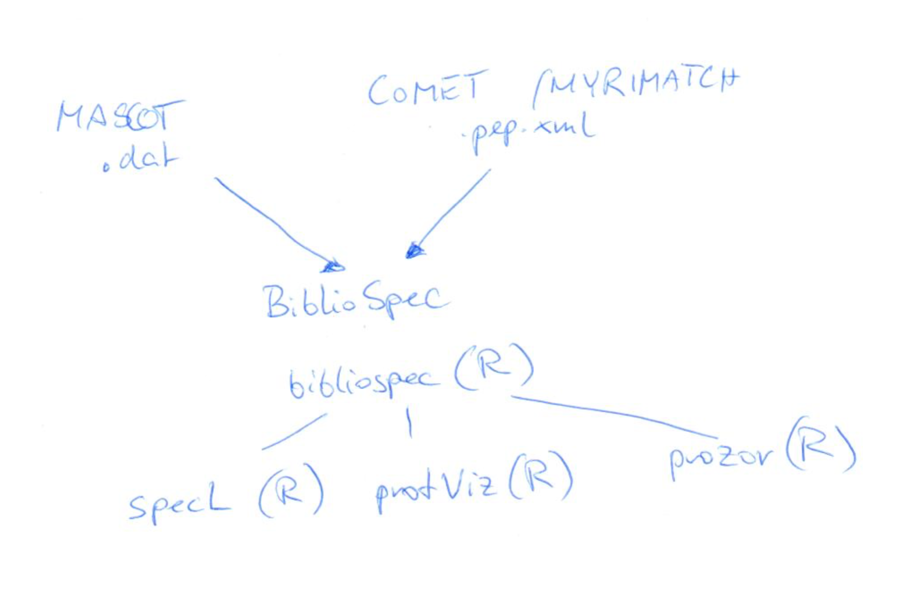

[](https://cran.r-project.org/package=bibliospec)  [](https://cran.r-project.org/package=bibliospec) [](https://cran.r-project.org/package=bibliospec) 

# bibliospec - provides a reference class for bibliospec files

<p align="center">
  
  <br>
</p>
Convert [mascot](http://www.matrixscience.com) .dat or [comet](http://comet-ms.sourceforge.net/) .pep.xml files with [BibliopSpec](https://skyline.gs.washington.edu/labkey/project/home/software/BiblioSpec/begin.view) into 
.sqlite files. Access the data with the [CRAN package bibliospec](https://cran.r-project.org/package=bibliospec) to analyse it with [specL](http://bioconductor.org/packages/specL/), [protViz](https://cran.r-project.org/package=protViz) or [prozor](https://github.com/wolski/prozor) in R.

## install the R package

```
install.packages('bibliospec')
```

## generate a bibliospec file


file from a *mascot result file* using the linux command line

```
~/bin/BiblioSpec/BlibBuild \
/usr/local/mascot/data/20160615/F237635.dat \
F237635.blib
```

Note: `BlibBuild` is contained in [proteowizard](http://proteowizard.sourceforge.net/) and link it to the [msparser](http://www.matrixscience.com/msparser.html) libraries. 


## references

UNIT 13.7 Using BiblioSpec for Creating and Searching Tandem MS,
Peptide Libraries. Barbara Frewen, Michael J. MacCoss.
Current Protocols in Bioinformatics Current Protocols in Bioinformatics.
[DOI: 10.1002/0471250953.bi1307s20](http://dx.doi.org/10.1002/0471250953.bi1307s20).

